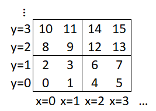
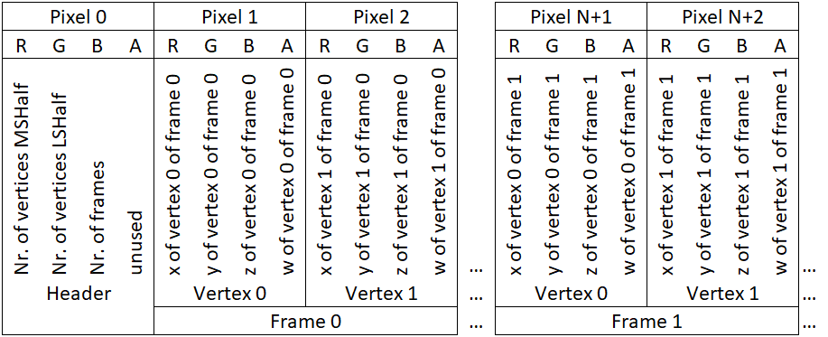

# Sansar-Blender-Tools
Blender Tools for Creating [Sansar](https://sansar.com/) Assets

Sections covered below:
- [Installation](#installation)
- [Usage](#usage)
- [Output](#output)
- [Texture Format](#texture-format)
- [Mesh Format](#mesh-format)
- [Credits](#credits)

## Installation
To install the addon, just download the zip file attached to the [latest release](https://github.com/TENS0R/Sansar-Blender-Tools/releases/latest), and install it as a regular blender addon (User Preferences -> Addons -> Install from file).

## Usage
The tool is integrated in the sidebar of the 3D Viewport under the Category 'Sansar Tools'.

Select one or several animated objects to be exported and press 'Start Processing' in the Vertex Animation Tab in the Sansar Tools side bar of the 3D view.
Settings (in the sidebar):
 * Frame range: Selection of frame range for export by specifying first and last frame as well as frame step size.
 * Generate mesh: If checked, the mesh to be uploaded to sansar is generated together with the displacement and normal map. If unchecked, only the textures are generated. 
  * Encode Map as Z-Curve: If checked, the generated images store the data in z-order (Morton Code), which is optimized for caching inside Sansar. In addition, the first pixel is used as a header encoding the number of vertices and the number frames. This option is required for generating Sansar assets. If disabled, the images store the data such that the vertices are the columns and the frames as rows of the images.
 * Export files: Export both images and the mesh (if generated) in the specified export path and filename prefix.

 ## Output
The following files will be generated by the add-on:
 * VAT_mesh.fbx: Converted mesh to be uploaded to Sansar. Note that the exported version is different from the original mesh because sharp edges have to be split in order to specify animated normals for each surface independently. 
 * VAT_map.exr: Texture to be uploaded to Sansar, which contains the animated displacement. 
 * VAT_normal.exr: Texture to be uploaded to Sansar, which contains the animated normal vectors. 

The add-on exports the files in a specific format as required by Sansar. 

## Texture Format
Sansar expects both VAT textures (vertex displacement and normal rotation) as float (half) and in a specific format. Each pixel (except the pixel at x=0, y=0, which is the header pixel) specifies the displacement/rotation of a vertex at one point in time. In order to optimize GPU cache, the vertex/frame index is not directly related to a x/y coordinate in the texture but has to be specified in a sequence encoded in a z-curve (see https://en.wikipedia.org/wiki/Z-order_curve). 



The order of the sequence is as follows: 
* First pixel is a header pixel which contains information about the number of vertices and frames. 
* Then the displacement/rotation of all vertices in the first frame are given.
* Then the displacement/rotation of all vertices in the second frame is given and so forth for all frames of the animation. 



### Header Pixel
The header pixel uses the Red and Green channels to encode the total number of vertices. It uses two channels in order to increase the allowed number of vertices beyond the capacity of a half precision number. Sansar will decode the header pixel as follows:
```python
vertex_count = (header.R + 2048) * 2048 + header.G + 2048 
frame_count frames   = header.B + 2048
```
Thus, the header has to be encoded as follows:
```python
header.R = (vertex_count // 2048) - 2048
header.G = (vertex_count % 2048) - 2048 
header.B = frame_count - 2048 
```
### Vertex Displacement
The displacement of a vertex at one frame is given by the Red, Green and Blue channel of the corresponding pixel, whereas the color channels directly correspond to the x,y,z displacement, respectively, given in object coordinates.

### Normal Rotation
The rotation of the normal vector (better said the rotation of the tangent space) is specified for each vertex in a separate texture (VAT_normal.exr). Here the Red, Green, Blue and Alpha channel correspond to the x, y, z and w of a rotation quaternion, respectively. 

## Mesh Format
The mesh is given by an fbx format with the following specific requirements:
* A secondary uv-map has to be provided to encode the vertex numbering. This is required because the order of vertices may be changed during import into Sansar due to mesh optimization. 
* Vertices with multiple different normals (e.g. at a sharp edge) need to be split if the animation moves the adjacent faces independently. This is required to specify a unique normal rotation for both sides. 

### Secondary UV-map
The exported mesh requires a secondary uv-map (which is generated automatically by the Blender add-on). The u/v coordinates of this map specify the vertex index to be used in the displacement and rotation map. Again both channels are used combined to increase the maximum number of vertices to be encoded with half precision. 
Sansar will decode the vertex index from the u/v coordinates by:
```python
vertexIdx = u + 2048 + (v + 2047) * 2048
```
Note that the v coordinate is shifted only by 2047 because Sansar internally flips the v coordinate on import and back in the shader. Therefore, the zero is shifted only by 2047 instead of 2048, which is the maximum number to be encoded by the 10 bit fraction in half precision. 

Thus, the uv data has to be encoded as follows:
```python
vertIdx_LSH = (vertexIdx % 2048) - 2048 
vertIdx_MSH = (vertexIdx // 2048) - 2047 
uv_data     = (vertIdx_LSH, vertIdx_MSH)
```

## Credits
The tool for extracting vertex animations is based on the [Unreal Tool for Vertex Animation](https://github.com/JoshRBogart/unreal_tools) by Joshua Bogart. It is ported to be used for Sansar and extended by the following features:
 * Storing the vertices and frames in z-order (Morton code) optimized for texture caching in Sansar.
 * Computation of rotation quaternion for updating tangent space and generation of corresponding map in addition to the displacement map.
 * Preprocessing of meshes for splitting sharp edges when vertices have different normals (required for correct update of tangent space).
 * Automatic export of images as exr textures and mesh as fbx.
